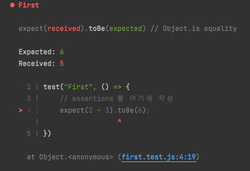
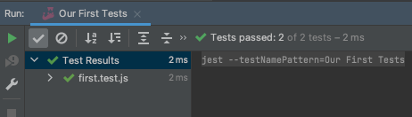

# Testing React Application

Udemy의 [React - testing](https://www.udemy.com/course/react-testing-app/) 강의를 수강하며 실습한 내용을 정리한 프로젝트입니다.   
본 강의에서는 아래 테스트 라이브러리 사용법을 배웁니다.

- Jest
- React Testing Library

## 실행 방법

```shell
yarn install
yarn test-jest      # jest 테스트 모두 실행 (./__tests__/...)
yarn test-react     # React Testing Library 테스트 모두 실행 (./src/tests/...) 
```

# JEST

## Test runner

- 테스트를 실행하는 파일의 종류
    - `[name].[test/spec].[js/ts]`
    - `__test__/[name].js`

## Keywords

`test` 함수로 테스트를 작성할 수 있다. 첫 번째 매개변수는 테스트의 이름이고, 두 번째는 테스트 함수 부분이다.

```jsx
test("First", () => {
    // assertions를 여기에 작성
    expect(2 + 3).toBe(6);
})
```

   
5 !== 6이기 때문에 테스트가 실패했다. 성공하려면 `toBe(5)`로 바꾸어 주어야 한다.

- `describe` 함수로 여러 테스트를 하나로 묶을 수 있다.
- `test`와 `it`은 기본적으로 같은 함수이다.

```jsx
describe("Our First Tests", () => {
    test("First", () => {
        // assertions 를 여기에 작성
        expect(2 + 3).toBe(5);
        expect(2 + 3).toBe(5);
        expect(2 + 3).toBe(5);
        expect(2 + 3).toBe(5);
        expect(2 + 3).toBe(5);
    })

    it("1-Second", () => {
        expect(2 + 1).toBe(3);
    })
})
describe("Our Second Tests", () => {

    it("some other test", () => {
        expect(2 + 1).toBe(3);
    })
})
```



describe를 실행하면 이렇게 묶어서 실행된다.

## 변수와 함수의 테스트

```jsx
let myValue = 1;

function add(x, y) {
    return x + y
}

function fakeAdd(x, y) {
    return 3
}

test("First", () => {
    let myValue2 = 3;
    expect(myValue).toBe(1);
    expect(myValue2).toBe(3);
    expect(add(myValue, myValue2)).toBe(4);
    expect(fakeAdd(1,2)).toBe(3);
    // expect(fakeAdd(4, 5)).toBe(9); // => 실패할 것임
})
```

- expect에 변수나 함수의 평가값을 넣어서 테스트할 수도 있다.
- 함수의 경우에는 가능한 많은 경우의 수를 넣어서 테스트하는 것이 좋다.

## Before & After Test

```jsx
let myValue = 1;

beforeAll(() => myValue = 3);

beforeEach(() => {
    console.log("Before Test")
    myValue = 2
})

afterEach(() => console.log("After the Test"))

test("Before and After", () => {
    expect(myValue).toBe(2);
    console.log("Inside Second Test")
})
```

- [before/after]Each ⇒ 모든 테스트 시작 직전에 실행됨
- [before/after]All ⇒ 테스트를 진행하기 한 번만 실행됨

## Skip, only and timeout

```jsx
// 이 테스트만 실행됨
test.only("only this one", () => {
    expect(add(1, 2)).toBe(3);
})

// 이 테스트만 스킵됨
test.skip("Skipped", () => {
    expect(add(1, 2)).toBe(3);
})

// timeout은 기본적으로 5초로 설정되어 있다. 이것보다 오래 걸리면 테스트 실패로 간주한다.
// 세 번째 인자 값을 바꾸어서 timeout 시간을 늘리거나 줄여줄 수 있다. 
test.skip("Timeout", () => {
    expect(add(1, 2)).toBe(3);
}, 1000)

// 혹은 jest의 설정 자체를 바꾸어 모든 테스트의 timeout 시간을 늘릴 수 있다.
jest.setTimeout(15000);
```

## Loops

```jsx
let numbers = [
    [1, 2, 3],
    [2,2,4],
    [4,5,9]
]

test.each(numbers)("Add %i to  %i", (a, b, total) => {
    expect(add(a, b)).toBe(total);
})
```

## Matchers

- toBe ⇒ 같은 객체를 가리키고 있는가를 확인함. `===`
- toEqual ⇒ 값이 같은지를 확인함. `==`
    - 따라서, 원시 타입일 때는 관계 없다.
    - 그러나 객체 타입일 때는, 같은 메모리 상의 객체가 아니라면 toBe 매칭을 했을 때 오류가 난다.

    ```jsx
    const obj1 = {name: "hi"}
    const obj2 = {name: "hi"}
    
    test("Matcher", () => {
        expect(obj1).toBe(obj1); // 성공
        expect(obj1).toBe(obj2); // 실패
        expect(obj1).toEqual(obj2); // 성공
    })
    ```

- 그 외에도 다양한 matcher가 있다.

```jsx
expect(myValue).toBeGreaterThan(0); // > 0
expect(myValue).toBeLessThanOrEqual(10); // <= 10

expect(name).toMatch(/HI/i); // 정규식을 사용하여 검사 가능

expect(animals).toContain("cat");
```

## Truthy and Falsy

- truthy ⇒ 참으로 여겨질 수 있는 모든 값.
- falsy ⇒ false로 여겨질 수 있는 모든 값.
    - 0, undefined, null, NaN, 음수, "", []

    ```jsx
    let p = null;
    test("Falsy", () => {
        expect(p).toBeNull();
        expect(p).not.toBeUndefined();
    
        expect(p).toBeFalsy();
        expect(p).not.toBeTruthy();
    })
    ```


<aside>
💡 모든 테스트는 expect와 matcher 사이에 `.not.` 을 넣어서 matcher의 값을 반전시킬 수 있다.
</aside>

## Testing errors

- 어떤 행동이 예외를 던질 것을 테스트할 수도 있다. 이 때, 예외의 종류나 메시지를 확인할 수도 있다.

```jsx
function check() {
    throw new Error("Fatal Mistake!");
}

test("Error", () => {
    expect(check).toThrow();
    expect(check).toThrow(Error);
    expect(check).toThrow("Fatal Mistake!");
    expect(check).toThrow(/fatal/i);
})
```

# React Testing Library

- 비슷한 라이브러리로는 enzyme이 있다.
- Jest가 함수나 변수의 Unit 테스트를 위한 것이었다면, React Testing Library로는 컴포넌트를 테스트할 것이다.

## Component Test

- Jest 테스트를 쓸 때와 동일하게 테스트를 작성해 주면 된다.
- `react-scripts test`를 실행하고 있으면 파일이 저장되어 변경될 때마다 테스트를 실행한다.
- react-testing-library에서 제공하는 render 메소드로 컴포넌트를 그려볼 수 있다.

```jsx
import React from 'react'
import Hello from '../components/Hello'
import { render } from '@testing-library/react'

test("Component should display Hello text", () => {
    const comp = render(<Hello />)
})
```

## First test with render

- `comp.debug()` 을 하면 DOM Tree를 보여준다.

```html
<body>
  <div>
    <div>
      <h1>
        Hello!
      </h1>
    </div>
  </div>
</body>
```

- `comp.getByText("Hello!")` 로 찾는 텍스트를 포함하고 있는 컴포넌트의 node 정보를 를 가져올 수 있다.

```html
<ref *1> HTMLHeadingElement {
        '__reactFiber$2evop6da7ev': <ref *2> FiberNode {
          tag: 5,
          key: null,
          elementType: 'h1',
          type: 'h1',
          stateNode: [Circular *1],
          return: FiberNode {
(이하 생략...)
```

- `toBeTruthy()` matcher로 컴포넌트가 존재하는지 확인할 수 있다.

```jsx
let helloText = comp.getByText("Hello!");
expect(helloText).toBeTruthy();
```

## Information available on the element

- render 함수로 얻은 DOM Tree는 deconstruct 가능하다.
- DOM Tree 안에서 얻은 React Node의 값에 접근해서 matcher 함수를 적용해 볼 수 있다.

```jsx
const { getByText } = render(<Hello />);

let helloText = getByText("Hello!");
expect(helloText).toBeTruthy();

expect(helloText.tagName).toBe("H1");
expect(helloText.textContent).toBe("Hello!");
```

## Methods to select elements

## Fire event